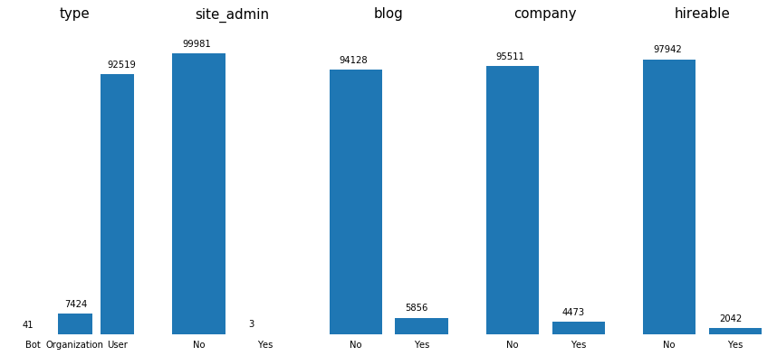
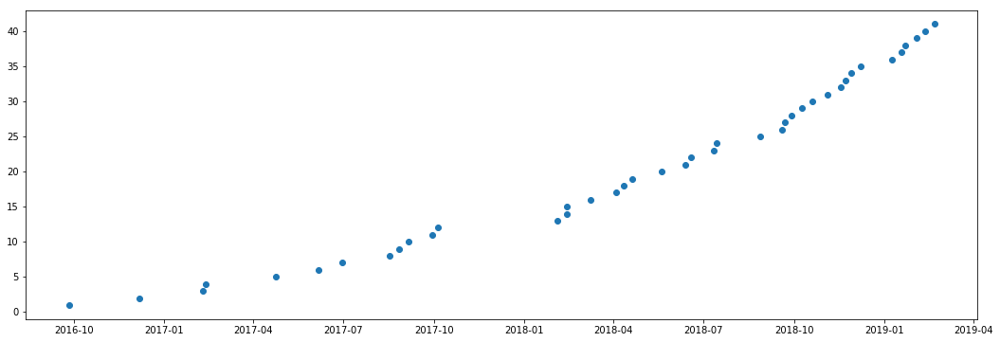
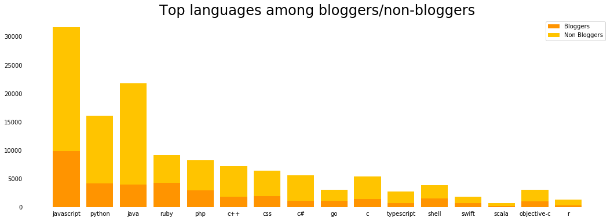
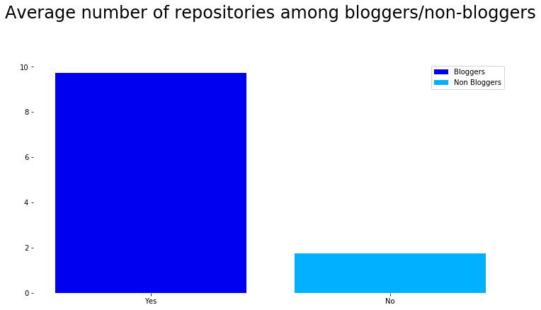
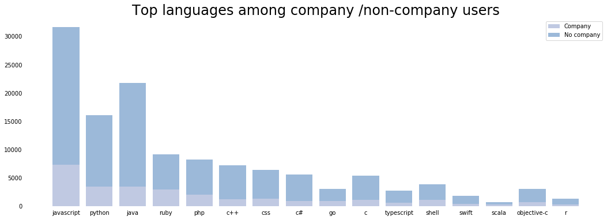
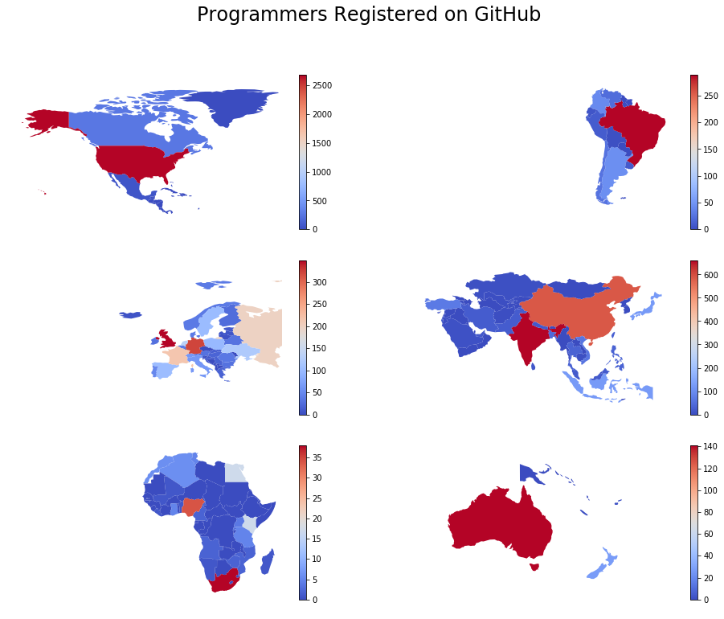
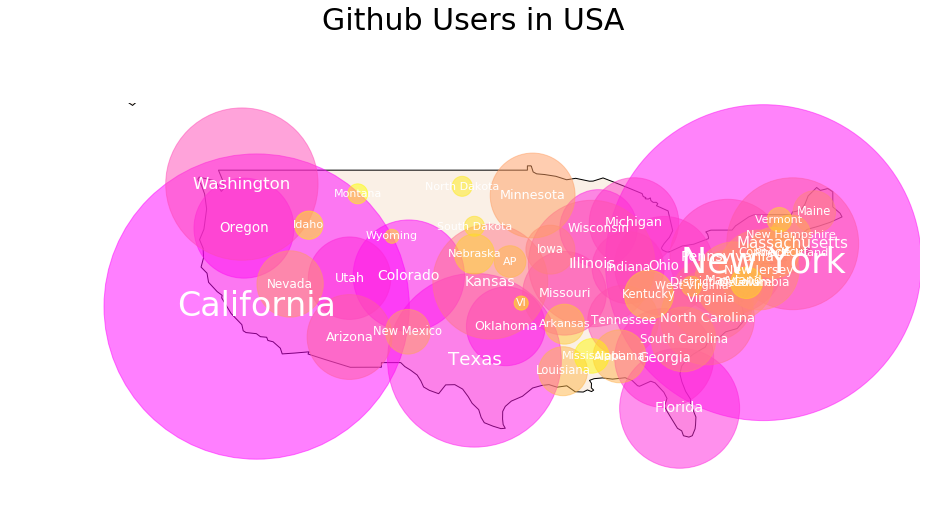

# Let's do web scraping

## Summary: In this project you will find out some cool insights about the GitHub users and their code.

### API selected: GitHub and Google Maps

### Student Name: Ruben Alvarez Martinez
### Student Number: 17201506


```python
%matplotlib inline

import requests
import json
from credentials import CREDENTIALS, GOOGLE_API_KEY
import random
import pandas as pd
import os
import numpy as np
import iso8601
from itertools import cycle
import matplotlib.pyplot as plt
import matplotlib

# Geopandas
import geopandas
from shapely.geometry import Point
import matplotlib.pyplot as plt

# Google API
from geopy.geocoders import GoogleV3
from geopy.exc import GeocoderQueryError
```

## As the GitHub API provides us with many different ways of extracting information, we will create a wrapper around its functions to make it more manageable and readable. We will wrap calls for functions that provide many users at once (bulk of users), a single user, a user's repo'sinformation, and detailed information about individual repositories. 

## We will also handle in a simple way the API call limit, allowing for the wrapper to switch to a different credential if the limit is reached with any given one.

## With that being said we will provide a set of credentials that will aid in the extraction of information in a faster way.


```python

class GitHubAPI(object):

    def __init__(self, username, password):
        self.username = username
        self.password = password
        self.response = None
        self.limit = False
        self.set_endpoints()
        # to remove:
        self.credentials = CREDENTIALS
        self.c = cycle(CREDENTIALS)
        self.remaining = None
        self.update_remaining()
        
    def get_users_since(self, since, per_page=100):
        self.response = self.request_get(self.endpoints[0].format(since=str(since), per_page=str(per_page)))
        return self.response.json()

    def get_user(self, user):
        self.response = self.request_get(self.endpoints[1].format(user=user))
        return self.response.json()
        
    def get_repos(self, user, per_page = 100):
        self.response = self.request_get(self.endpoints[2].format(user=user, per_page=str(per_page)))
        return self.response.json()
    
    def get_languages(self, user, repo):
        self.response = self.request_get(self.endpoints[3].format(user=user, repo=repo))
        return self.response.json()

    def check_limit(self):
        if self.remaining == 0:
            self.limit = True
        else:
            self.limit = False

    def update_remaining(self):
        response =  requests.get(self.endpoints[4], auth=(self.username, self.password))
        response = response.json()
        self.remaining = response['resources']['core']['remaining']

    def request_get(self, endpoint):
        self.check_limit()

        if self.limit:
            self.switch_user()
            self.update_remaining()
            return self.request_get(endpoint)
        
        self.remaining -= 1
        return requests.get(endpoint, auth=(self.username, self.password))
        
    def set_endpoints(self):
        self.endpoints = []
        self.endpoints.append('https://api.github.com/users?since={since}&per_page={per_page}')
        self.endpoints.append('https://api.github.com/users/{user}')
        self.endpoints.append('https://api.github.com/users/{user}/repos?per_page={per_page}')
        self.endpoints.append('https://api.github.com/repos/{user}/{repo}/languages')
        self.endpoints.append('https://api.github.com/rate_limit')

    # to remove:
    def switch_user(self):
        next_value = next(self.c)
        self.username = next_value[0]
        self.password = next_value[1]
        print("User switched")

```

##  We know that the total amount of users in github, up today, is around 48M (this number is based on the latest # of user's ids). As we are trying to find patterns in user behaviour we will try and sample users pseudo randomly and from the whole space, for that we will generate a spaced list starting from 1 up to 48Million, the spacing will be set to steps of 48k, at each step we will generate a rand value that will be added to the current spacing value. This values will be used as index to extract data.         i.e. spacing value #1 + random value #1, spacing value #2 + random value #2 ..... up to spacing value #1k + rand value #1k

## For this request the github api allows us to get 100 consecutive users at each call, with a limit of 5k calls per hour per user. We will call 1k times * 100 users = 100k total users.


```python
def get_users_from_gh(gh, save_path):
        """ Gets 100k users from GitHub
        """

        spacing = 48000
        random.seed(42)
        intervals = [spacing*i + x for i, x in enumerate(sorted(random.sample(range(0, spacing-100), 1000)))] #-100 so we dont overlap intervals

        # Create a placeholder dictionary to append all the users in a single structure
        users = {
            'login': [],
            'id': [],
            'type': [],
            'site_admin': [],
        }

        # do a call per interval value and pass it to the since parameter
        for since in intervals:
            # this returns a list of 100 elements where each element is a github user
            response = gh.get_users_since(since=since, per_page=100)
            # iterate through each user and append the data into our structure
            for user in response:
                        
                users['login'].append(user['login'])
                users['id'].append(user['id'])
                users['type'].append(user['type'])
                users['site_admin'].append(user['site_admin'])

        pd.DataFrame(users).to_csv(save_path)

```

# Start first API call, retrieve 100k users from GitHub


```python
#instantiate our wrapper with credentials
gh = GitHubAPI(username=CREDENTIALS[0][0], password=CREDENTIALS[0][1])

# if file was already created, do not run the calls
if not os.path.isfile('./first_level/users_first_level.csv'):
    get_users_from_gh(gh, './first_level/users_first_level.csv')
```

## Now we have 100k users


```python
data = pd.read_csv('./first_level/users_first_level.csv', index_col = 0)
data.head()
```


<div>
<table border="1" class="dataframe">
  <thead>
    <tr style="text-align: right;">
      <th></th>
      <th>login</th>
      <th>id</th>
      <th>type</th>
      <th>site_admin</th>
    </tr>
  </thead>
  <tbody>
    <tr>
      <th>0</th>
      <td>anotherjesse</td>
      <td>27</td>
      <td>User</td>
      <td>False</td>
    </tr>
    <tr>
      <th>1</th>
      <td>roland</td>
      <td>28</td>
      <td>User</td>
      <td>False</td>
    </tr>
    <tr>
      <th>2</th>
      <td>lukas</td>
      <td>29</td>
      <td>User</td>
      <td>False</td>
    </tr>
    <tr>
      <th>3</th>
      <td>fanvsfan</td>
      <td>30</td>
      <td>User</td>
      <td>False</td>
    </tr>
    <tr>
      <th>4</th>
      <td>tomtt</td>
      <td>31</td>
      <td>User</td>
      <td>False</td>
    </tr>
  </tbody>
</table>
</div>


```python
def split_level_one(path_read):
    data = pd.read_csv(path_read)
    length = data.shape[0]
    chunk_size = length//len(CREDENTIALS)
    chunks = length//chunk_size
    for i in range(chunks):
        chunk = data.iloc[i * chunk_size : (i * chunk_size) + chunk_size]
        if not os.path.isfile('first_level/first_level_' + str(i).zfill(2) + '.csv'):
            chunk.to_csv('first_level/first_level_' + str(i).zfill(2) + '.csv', index=False)
    print("All chunks processed, split done")
```

## By retrieving many users at once we get very few real information most of it are links to sections deeper in the tree. We will use now the users' login name to retrieve more meaning information. However, this time we don't get to call in bulk, we have to make a call per user, as we have 100k users and we are limited to 5k calls per autheticated account per hour we will split the original file into many chunks so that we can reduce the load per credential


```python
# split users_first_level.csv file into parts so that each credential can handle a full file, otherwise it takes forever
split_level_one('./first_level/users_first_level.csv')
```

    All chunks processed, split done
    


```python

def get_users_info(gh, path_read, path_write):

    """
    The GitHub API returns very few information about a user when calling for multiple users at once (get_users_from_gh(gh)),
    we have to access each individual user to extract more meaningful information.
    We will read our users_first_level.csv file to extract each login instance which corresponds to the username and call do
    a call per user.
    """
    #read csv, set first col as index
    users_data = pd.read_csv(path_read, index_col = 0)
    # we only care about usernames
    users = users_data['login']

    #Create a placeholder dictionary to store all the user info
    users_info = {
        'login': [],
        'id': [],
        'type': [],
        'site_admin': [],
        'company': [],
        'blog': [],
        'location': [],
        'hireable': [],
        'public_repos': [],
        'public_gists': [],
        'followers': [],
        'following': [],
        'created_at': [],
        'updated_at': []
    }

    # Interate through all users (100k), these are 100k calls.
    # NOTE: remember that the GitHub API only allows for 5k calls/hour per user, however, our wrapper has setup a strategy,
    # we have a list of credentials (username and password) we check the remaining calls per user at each call, once we hit the
    # limit we switch to another credential by means of switch_user() and we repeat the process.

    for user_ in users:
        # user_info is None when the request is None
        user_info = gh.get_user(user_)
        try:
            for key in users_info:
                users_info[key].append(user_info[key])
        except KeyError:
            # save values as nan for when call returns None
            print("KeyError")
            for key in users_info:
                users_info[key].append(np.nan)

    pd.DataFrame(users_info).to_csv(path_write)
```

## Our file has been splitted, now let's assign different credentials to different splits. We will extract the user's login name from each file to call for the users' data.


# Start call for users' data (second level info)


```python
# Call each file and make the calls with a given credential
for i in range(len(CREDENTIALS)):
    if not os.path.isfile('second_level/users_second_level_' + str(i).zfill(2) + '.csv'):
        gh = GitHubAPI(username=CREDENTIALS[i][0], password=CREDENTIALS[i][1])
        get_users_info(gh, './first_level/first_level_' + str(i).zfill(2) + '.csv','./second_level/users_second_level_' + str(i).zfill(2) + '.csv')
```


```python
# read one of the files in the second level
data = pd.read_csv('./second_level/users_second_level_00.csv', index_col = 0)
data.head()
```


<div>
<table border="1" class="dataframe">
  <thead>
    <tr style="text-align: right;">
      <th></th>
      <th>login</th>
      <th>id</th>
      <th>type</th>
      <th>site_admin</th>
      <th>company</th>
      <th>blog</th>
      <th>location</th>
      <th>hireable</th>
      <th>public_repos</th>
      <th>public_gists</th>
      <th>followers</th>
      <th>following</th>
      <th>created_at</th>
      <th>updated_at</th>
    </tr>
  </thead>
  <tbody>
    <tr>
      <th>0</th>
      <td>anotherjesse</td>
      <td>27.0</td>
      <td>User</td>
      <td>False</td>
      <td>Planet Labs</td>
      <td>http://overstimulate.com</td>
      <td>San Francisco, CA</td>
      <td>NaN</td>
      <td>87.0</td>
      <td>42.0</td>
      <td>143.0</td>
      <td>31.0</td>
      <td>2008-01-15T07:49:30Z</td>
      <td>2019-03-14T21:18:22Z</td>
    </tr>
    <tr>
      <th>1</th>
      <td>roland</td>
      <td>28.0</td>
      <td>User</td>
      <td>False</td>
      <td>NaN</td>
      <td>http://rolandmai.com/</td>
      <td>Tirana</td>
      <td>NaN</td>
      <td>7.0</td>
      <td>0.0</td>
      <td>11.0</td>
      <td>1.0</td>
      <td>2008-01-15T08:12:51Z</td>
      <td>2018-07-25T09:18:29Z</td>
    </tr>
    <tr>
      <th>2</th>
      <td>lukas</td>
      <td>29.0</td>
      <td>User</td>
      <td>False</td>
      <td>CrowdFlower</td>
      <td>lukasbiewald.com</td>
      <td>San Francisco</td>
      <td>NaN</td>
      <td>24.0</td>
      <td>5.0</td>
      <td>199.0</td>
      <td>6.0</td>
      <td>2008-01-15T12:50:02Z</td>
      <td>2019-03-14T18:14:09Z</td>
    </tr>
    <tr>
      <th>3</th>
      <td>fanvsfan</td>
      <td>30.0</td>
      <td>User</td>
      <td>False</td>
      <td>NaN</td>
      <td>NaN</td>
      <td>NaN</td>
      <td>NaN</td>
      <td>0.0</td>
      <td>0.0</td>
      <td>13.0</td>
      <td>0.0</td>
      <td>2008-01-15T14:15:23Z</td>
      <td>2018-02-02T01:49:27Z</td>
    </tr>
    <tr>
      <th>4</th>
      <td>tomtt</td>
      <td>31.0</td>
      <td>User</td>
      <td>False</td>
      <td>Freelance</td>
      <td>tomtenthij.nl</td>
      <td>Amsterdam</td>
      <td>True</td>
      <td>72.0</td>
      <td>241.0</td>
      <td>29.0</td>
      <td>12.0</td>
      <td>2008-01-15T15:44:31Z</td>
      <td>2019-01-28T10:16:39Z</td>
    </tr>
  </tbody>
</table>
</div>


## Now we have more meaningful data about each user, splitted in the same number of files as our first splitt


```python
def get_repos_from_gh(gh, path_read, path_write):

    users_data = pd.read_csv(path_read, index_col = 0)

    # we only care about usernames
    users = users_data['login']
    # some rows are missing, drop them
    users = users.dropna()

    # Create a placeholder dictionary to store all the repos info, the info will have to be a summary of all the repos,
    # numeric values will be added, boolean values will be parsed to int and added together, for any other we will treat
    # them as boolean and parse them to int to add them again.

    # main placeholder dictionary
    repos = {
        # user:
        'login': [],
        # repos info (an auxiliary dictionary is created out of these)
        'stargazers_count': [],
        'watchers_count': [],
        'has_issues': [],
        'has_projects': [],
        'has_downloads': [],
        'has_wiki': [],
        'has_pages': [],
        'forks_count': [],
        'open_issues_count': [],
        'license': [],
        'forks': [],
        'open_issues': [],
        'watchers': [],
        # repos languages (an auxiliary dictionary is created out of these, these keys are not present in the incoming data),
        # we will populate them by analysing each user's repo.
        'javascript': [],
        'python': [],
        'java': [],
        'ruby': [],
        'php': [],
        'c++': [],
        'css': [],
        'c#': [],
        'go': [],
        'c': [],
        'typescript': [],
        'shell': [],
        'swift': [],
        'scala': [],
        'objective-c': [],
        'r': [],
        'others': []
    }

    # for every user
    for user in users:
        # get all the user repos (a max of 60 repos per user is allowed)
        user_repos = gh.get_repos(user)

        # auxiliary placeholder dictionary (this structure is a subset of the incoming data)
        summary = {
            'stargazers_count': [], # int
            'watchers_count': [], # int
            'has_issues': [], # bool
            'has_projects': [], # bool
            'has_downloads': [], # bool
            'has_wiki': [], # bool
            'has_pages': [], # bool
            'forks_count': [], # int
            'open_issues_count': [], # int
            'license': [], # str or None
            'forks': [], # int
            'open_issues': [], # int
            'watchers': [], # int
            'language': [] # str or None
        }

        # all summary keys without 'language'
        summary_keys_no_lg = list(summary.keys())[:-1]

        # auxiliary placeholder dictionary (will populate keys from our main placeholder dictionary)
        languages = {
            'javascript': 0,
            'python': 0,
            'java': 0,
            'ruby': 0,
            'php': 0,
            'c++': 0,
            'css': 0,
            'c#': 0,
            'go': 0,
            'c': 0,
            'typescript': 0,
            'shell': 0,
            'swift': 0,
            'scala': 0,
            'objective-c': 0,
            'r': 0,
            'others': 0
        }

        # all languages keys without 'others'
        languages_no_other = list(languages.keys())[:-1]

        # iterate through repos, analyse data and parse it. Populate auxiliary placeholders and after getting out of the loop
        # append results to main placeholder
        # if user has no repos, we will get an empty list, skipping the loop and assigning 0's to all key elements.

        for repo in user_repos:
            for key in summary:
                # parse values, languages will have to have their own column, so we will add all appeareances of a single 
                # language over the whole set of repositories for a single user, then, pass this sum to the main dictionary.
                # Some users have changed their username while I was running this step, meaning that when calling for them it
                # returns an error message in the form of a dictionary, we will skip these users.
                try:
                    value = repo[key] # fails if key does not exist in repo dict
                except TypeError:
                    print("KeyError")
                    break # get out of the loop and assign 0's to all entries of current user.
                
                # if key is langauge, process it and assign it to our auxiliary languages dictionary
                if key == 'language':

                    if value is None:
                        value = "null"
                    value = value.lower()

                    # if the value is in languages (else increment 'others')
                    # The list of languages was selected based on the top 15 languages in github (R was also included because
                    # statistics <3 )
                    if value in languages_no_other:
                        # iterate over every language ("others" is not included)
                        for language in languages_no_other:
                            if value == language:
                                languages[language] += 1
                                # once the language variable is incremented get out of loop
                                break
                    else:
                        languages['others'] += 1
                        
                # if key is not language, parse values as following
                else:
                    if type(value) is bool:
                        value = int(value)
                    elif type(value) is str or type(value) is dict:
                        value = 1
                    elif type(value) is type(None):
                        value = 0

                    # once the value is parsed, append it to our auxiliary placeholder dictionary
                    summary[key].append(value)

        # After finishing collecting info from all the user's repos we pass it to our main placeholder dictionary

        # set instance user
        repos['login'].append(user)

        # set all the instance languages
        for language in languages:
            repos[language].append(languages[language])

        # set all the instance values from summary object
        for key in summary_keys_no_lg:
            repos[key].append(sum(summary[key]))
    
    #save data to a file
    pd.DataFrame(repos).to_csv(path_write, index=False)

```

## We would also like to know what is the activity related to user repositories. Use the first splitted files to extract the user's login name and call for their repository information


# Start call for users's repos (third level info)


```python
# Call each file and make the calls with a given credential
for i in range(len(CREDENTIALS)):
    if not os.path.isfile('./third_level/users_third_level_' + str(i).zfill(2) + '.csv'):
        gh = GitHubAPI(username=CREDENTIALS[i][0], password=CREDENTIALS[i][1])
        get_repos_from_gh(gh, './first_level/first_level_'+ str(i).zfill(2) +'.csv', './third_level/users_third_level_' + str(i).zfill(2) + '.csv')

```


```python
# read one of the files in the third level
data = pd.read_csv('./third_level/users_third_level_00.csv')
data.head()
```


<div>
<table border="1" class="dataframe">
  <thead>
    <tr style="text-align: right;">
      <th></th>
      <th>login</th>
      <th>stargazers_count</th>
      <th>watchers_count</th>
      <th>has_issues</th>
      <th>has_projects</th>
      <th>has_downloads</th>
      <th>has_wiki</th>
      <th>has_pages</th>
      <th>forks_count</th>
      <th>open_issues_count</th>
      <th>...</th>
      <th>c#</th>
      <th>go</th>
      <th>c</th>
      <th>typescript</th>
      <th>shell</th>
      <th>swift</th>
      <th>scala</th>
      <th>objective-c</th>
      <th>r</th>
      <th>others</th>
    </tr>
  </thead>
  <tbody>
    <tr>
      <th>0</th>
      <td>anotherjesse</td>
      <td>344</td>
      <td>344</td>
      <td>54</td>
      <td>87</td>
      <td>86</td>
      <td>80</td>
      <td>2</td>
      <td>180</td>
      <td>10</td>
      <td>...</td>
      <td>0</td>
      <td>0</td>
      <td>0</td>
      <td>0</td>
      <td>1</td>
      <td>0</td>
      <td>0</td>
      <td>3</td>
      <td>0</td>
      <td>20</td>
    </tr>
    <tr>
      <th>1</th>
      <td>roland</td>
      <td>20</td>
      <td>20</td>
      <td>6</td>
      <td>7</td>
      <td>7</td>
      <td>7</td>
      <td>0</td>
      <td>6</td>
      <td>1</td>
      <td>...</td>
      <td>3</td>
      <td>0</td>
      <td>0</td>
      <td>0</td>
      <td>0</td>
      <td>0</td>
      <td>0</td>
      <td>0</td>
      <td>0</td>
      <td>1</td>
    </tr>
    <tr>
      <th>2</th>
      <td>lukas</td>
      <td>399</td>
      <td>399</td>
      <td>15</td>
      <td>24</td>
      <td>24</td>
      <td>24</td>
      <td>1</td>
      <td>591</td>
      <td>26</td>
      <td>...</td>
      <td>0</td>
      <td>0</td>
      <td>0</td>
      <td>0</td>
      <td>0</td>
      <td>0</td>
      <td>0</td>
      <td>0</td>
      <td>0</td>
      <td>7</td>
    </tr>
    <tr>
      <th>3</th>
      <td>fanvsfan</td>
      <td>0</td>
      <td>0</td>
      <td>0</td>
      <td>0</td>
      <td>0</td>
      <td>0</td>
      <td>0</td>
      <td>0</td>
      <td>0</td>
      <td>...</td>
      <td>0</td>
      <td>0</td>
      <td>0</td>
      <td>0</td>
      <td>0</td>
      <td>0</td>
      <td>0</td>
      <td>0</td>
      <td>0</td>
      <td>0</td>
    </tr>
    <tr>
      <th>4</th>
      <td>tomtt</td>
      <td>249</td>
      <td>249</td>
      <td>37</td>
      <td>72</td>
      <td>69</td>
      <td>66</td>
      <td>1</td>
      <td>114</td>
      <td>3</td>
      <td>...</td>
      <td>0</td>
      <td>0</td>
      <td>0</td>
      <td>0</td>
      <td>0</td>
      <td>0</td>
      <td>0</td>
      <td>0</td>
      <td>0</td>
      <td>13</td>
    </tr>
  </tbody>
</table>
<p>5 rows × 31 columns</p>
</div>


## Finally we have the repositorie's information per user, this information is splitted in the same number of splits as our initial split and as our second level information files.


```python

def read_and_merge(path_write):
    # create a placeholder dataframe to append all data
    all_data = pd.DataFrame()
    # load first level files
    file_count = len(os.listdir('first_level/'))-1 # do not count the original first level file
    print("Merging starts...")
    for count in range(file_count):
        f_lvl = pd.read_csv('first_level/first_level_'+ str(count).zfill(2) +'.csv', index_col=1)
        f_lvl = f_lvl.drop(columns=['Unnamed: 0']) # we previously saved our dataframe with indexes, we don't care about them
        # load second level files
        s_lvl = pd.read_csv('second_level/users_second_level_'+ str(count).zfill(2) +'.csv', index_col = 1)
        s_lvl = s_lvl.drop(columns=['Unnamed: 0']) # we previously saved our dataframe with indexes, we don't care about them
        # merge first and second level
        # avoid duplicated columns
        cols_to_use = s_lvl.columns.difference(f_lvl.columns)
        # use index from both df's as reference for merging
        merge_lvl_1_2 = f_lvl.merge(s_lvl[cols_to_use], left_index=True ,right_index=True)
        # # load third level files
        t_lvl = pd.read_csv('third_level/users_third_level_'+ str(count).zfill(2) +'.csv', index_col = 0)
        # # merge last merged files with third level files
        cols_to_use = t_lvl.columns.difference(merge_lvl_1_2)
        f_merge = merge_lvl_1_2.merge(t_lvl[cols_to_use], left_index=True, right_index=True)
        # print("Final merge shape: ", f_merge.shape)
        all_data = all_data.append(f_merge, ignore_index=False)

    if not os.path.isfile(path_write):
        all_data.to_csv(path_write)
    
    
    print("Merging finished")
    return all_data

```

## Let's now merge all the data sets (first, second and third level of information). We will use the login column as index and as reference to merge the dataframes


```python
all_data = read_and_merge('all_levels/all_data.csv')
```

    Merging starts...
    Merging finished
    


```python
# read one of the files in the third level
all_data = pd.read_csv('./all_levels/all_data.csv')
all_data.head()
```


<div>
<table border="1" class="dataframe">
  <thead>
    <tr style="text-align: right;">
      <th></th>
      <th>login</th>
      <th>id</th>
      <th>type</th>
      <th>site_admin</th>
      <th>blog</th>
      <th>company</th>
      <th>created_at</th>
      <th>followers</th>
      <th>following</th>
      <th>hireable</th>
      <th>...</th>
      <th>python</th>
      <th>r</th>
      <th>ruby</th>
      <th>scala</th>
      <th>shell</th>
      <th>stargazers_count</th>
      <th>swift</th>
      <th>typescript</th>
      <th>watchers</th>
      <th>watchers_count</th>
    </tr>
  </thead>
  <tbody>
    <tr>
      <th>0</th>
      <td>anotherjesse</td>
      <td>27</td>
      <td>User</td>
      <td>False</td>
      <td>http://overstimulate.com</td>
      <td>Planet Labs</td>
      <td>2008-01-15T07:49:30Z</td>
      <td>143.0</td>
      <td>31.0</td>
      <td>NaN</td>
      <td>...</td>
      <td>24</td>
      <td>0</td>
      <td>15</td>
      <td>0</td>
      <td>1</td>
      <td>344</td>
      <td>0</td>
      <td>0</td>
      <td>344</td>
      <td>344</td>
    </tr>
    <tr>
      <th>1</th>
      <td>roland</td>
      <td>28</td>
      <td>User</td>
      <td>False</td>
      <td>http://rolandmai.com/</td>
      <td>NaN</td>
      <td>2008-01-15T08:12:51Z</td>
      <td>11.0</td>
      <td>1.0</td>
      <td>NaN</td>
      <td>...</td>
      <td>0</td>
      <td>0</td>
      <td>0</td>
      <td>0</td>
      <td>0</td>
      <td>20</td>
      <td>0</td>
      <td>0</td>
      <td>20</td>
      <td>20</td>
    </tr>
    <tr>
      <th>2</th>
      <td>lukas</td>
      <td>29</td>
      <td>User</td>
      <td>False</td>
      <td>lukasbiewald.com</td>
      <td>CrowdFlower</td>
      <td>2008-01-15T12:50:02Z</td>
      <td>199.0</td>
      <td>6.0</td>
      <td>NaN</td>
      <td>...</td>
      <td>15</td>
      <td>0</td>
      <td>1</td>
      <td>0</td>
      <td>0</td>
      <td>399</td>
      <td>0</td>
      <td>0</td>
      <td>399</td>
      <td>399</td>
    </tr>
    <tr>
      <th>3</th>
      <td>fanvsfan</td>
      <td>30</td>
      <td>User</td>
      <td>False</td>
      <td>NaN</td>
      <td>NaN</td>
      <td>2008-01-15T14:15:23Z</td>
      <td>13.0</td>
      <td>0.0</td>
      <td>NaN</td>
      <td>...</td>
      <td>0</td>
      <td>0</td>
      <td>0</td>
      <td>0</td>
      <td>0</td>
      <td>0</td>
      <td>0</td>
      <td>0</td>
      <td>0</td>
      <td>0</td>
    </tr>
    <tr>
      <th>4</th>
      <td>tomtt</td>
      <td>31</td>
      <td>User</td>
      <td>False</td>
      <td>tomtenthij.nl</td>
      <td>Freelance</td>
      <td>2008-01-15T15:44:31Z</td>
      <td>29.0</td>
      <td>12.0</td>
      <td>True</td>
      <td>...</td>
      <td>0</td>
      <td>0</td>
      <td>50</td>
      <td>0</td>
      <td>0</td>
      <td>249</td>
      <td>0</td>
      <td>0</td>
      <td>249</td>
      <td>249</td>
    </tr>
  </tbody>
</table>
<p>5 rows × 44 columns</p>
</div>


## We have merged the data into a single file, almost 100k users and 44 columns of information, the remaining users were lost due to modifications made by these users in between the calls, such as changing the username. Another thing to notice is that the information is not ready for analysis, we have missing values and strings that do not provide meaningful information:


```python

def read_and_transform(path_read, path_write):
    # We will transform data as follows:
    """
    site_admin  = "Yes"/"No"
    blog        = "Yes"/"No"
    company     = "Yes"/"No"
    created_at  = DateTime
    hirable     = "Yes"/"No"
    location    = Just clean NA's
    updated_at  = DateTime
    The rest of the columns are suitable for analysis (numeric)
    """
    
    data = pd.read_csv('all_levels/all_data.csv', index_col = 0)
    # inspect columns for NAs
    for column in data.columns:
        if data[column].isnull().values.any():
            print("There are nan values in {column}".format(column=column))
    
    print("\nTransforming data...")
    
    columns_to_transform = ['site_admin','blog','company','hireable'] #Yes/No transformation

    # transform the columns to "Yes"/"No"
    for column in columns_to_transform:
        if  data[column].isnull().values.any():
            data[column] = data[data[column].notnull()]
        if type(data[column]) == bool:
            data[column] = data[column].apply(lambda x: "Yes" if x is True else "No")
        else:
            data[column] = data[column].apply(lambda x: "Yes" if x > 0 else "No")

    # Clean NAs in location
    data.location = data.location.fillna('Unkown')

    # Transform created_at and updated_at DateTime type
    date_columns = ['created_at', 'updated_at']

    for column in date_columns:
        data[column] = data[column].apply(iso8601.parse_date)


    #check if there are still nan values in df
    nan_values = 0
    for column in data.columns:
        if data[column].isnull().values.any():
            nan_values += 1, 
    print("Total nan values found: {nan_values}".format(nan_values=nan_values))
    
    print("\nTransformation finished")
    if not os.path.isfile(path_write):
        data.to_csv(path_write)
    return data
```


# Start the feature transformation process


```python
data_fixed = read_and_transform('all_levels/all_data.csv', 'all_levels/all_data_fixed.csv')
```

    There are nan values in blog
    There are nan values in company
    There are nan values in hireable
    There are nan values in location
    
    Transforming data...
    Total nan values found: 0
    
    Transformation finished
    


```python
data_fixed = pd.read_csv('all_levels/all_data_fixed.csv')
data_fixed.head()
```


<div>
<table border="1" class="dataframe">
  <thead>
    <tr style="text-align: right;">
      <th></th>
      <th>login</th>
      <th>id</th>
      <th>type</th>
      <th>site_admin</th>
      <th>blog</th>
      <th>company</th>
      <th>created_at</th>
      <th>followers</th>
      <th>following</th>
      <th>hireable</th>
      <th>...</th>
      <th>python</th>
      <th>r</th>
      <th>ruby</th>
      <th>scala</th>
      <th>shell</th>
      <th>stargazers_count</th>
      <th>swift</th>
      <th>typescript</th>
      <th>watchers</th>
      <th>watchers_count</th>
    </tr>
  </thead>
  <tbody>
    <tr>
      <th>0</th>
      <td>anotherjesse</td>
      <td>27</td>
      <td>User</td>
      <td>No</td>
      <td>Yes</td>
      <td>Yes</td>
      <td>2008-01-15 07:49:30+00:00</td>
      <td>143.0</td>
      <td>31.0</td>
      <td>No</td>
      <td>...</td>
      <td>24</td>
      <td>0</td>
      <td>15</td>
      <td>0</td>
      <td>1</td>
      <td>344</td>
      <td>0</td>
      <td>0</td>
      <td>344</td>
      <td>344</td>
    </tr>
    <tr>
      <th>1</th>
      <td>roland</td>
      <td>28</td>
      <td>User</td>
      <td>No</td>
      <td>Yes</td>
      <td>No</td>
      <td>2008-01-15 08:12:51+00:00</td>
      <td>11.0</td>
      <td>1.0</td>
      <td>No</td>
      <td>...</td>
      <td>0</td>
      <td>0</td>
      <td>0</td>
      <td>0</td>
      <td>0</td>
      <td>20</td>
      <td>0</td>
      <td>0</td>
      <td>20</td>
      <td>20</td>
    </tr>
    <tr>
      <th>2</th>
      <td>lukas</td>
      <td>29</td>
      <td>User</td>
      <td>No</td>
      <td>Yes</td>
      <td>Yes</td>
      <td>2008-01-15 12:50:02+00:00</td>
      <td>199.0</td>
      <td>6.0</td>
      <td>No</td>
      <td>...</td>
      <td>15</td>
      <td>0</td>
      <td>1</td>
      <td>0</td>
      <td>0</td>
      <td>399</td>
      <td>0</td>
      <td>0</td>
      <td>399</td>
      <td>399</td>
    </tr>
    <tr>
      <th>3</th>
      <td>fanvsfan</td>
      <td>30</td>
      <td>User</td>
      <td>No</td>
      <td>No</td>
      <td>No</td>
      <td>2008-01-15 14:15:23+00:00</td>
      <td>13.0</td>
      <td>0.0</td>
      <td>No</td>
      <td>...</td>
      <td>0</td>
      <td>0</td>
      <td>0</td>
      <td>0</td>
      <td>0</td>
      <td>0</td>
      <td>0</td>
      <td>0</td>
      <td>0</td>
      <td>0</td>
    </tr>
    <tr>
      <th>4</th>
      <td>tomtt</td>
      <td>31</td>
      <td>User</td>
      <td>No</td>
      <td>Yes</td>
      <td>Yes</td>
      <td>2008-01-15 15:44:31+00:00</td>
      <td>29.0</td>
      <td>12.0</td>
      <td>Yes</td>
      <td>...</td>
      <td>0</td>
      <td>0</td>
      <td>50</td>
      <td>0</td>
      <td>0</td>
      <td>249</td>
      <td>0</td>
      <td>0</td>
      <td>249</td>
      <td>249</td>
    </tr>
  </tbody>
</table>
<p>5 rows × 44 columns</p>
</div>


# Let's dig into the data


```python
data = pd.read_csv('all_levels/all_data_fixed.csv', index_col = 0)
        
uniques = {}
for column in data.columns:
    uniques[column] = len(data[column].unique())
uniques
```


    {'id': 99984,
     'type': 3,
     'site_admin': 2,
     'blog': 2,
     'company': 2,
     'created_at': 84402,
     'followers': 195,
     'following': 149,
     'hireable': 2,
     'location': 3726,
     'public_gists': 115,
     'public_repos': 209,
     'updated_at': 76634,
     'c': 32,
     'c#': 34,
     'c++': 36,
     'css': 22,
     'forks': 229,
     'forks_count': 229,
     'go': 32,
     'has_downloads': 101,
     'has_issues': 88,
     'has_pages': 34,
     'has_projects': 101,
     'has_wiki': 101,
     'java': 59,
     'javascript': 63,
     'license': 87,
     'objective-c': 36,
     'open_issues': 155,
     'open_issues_count': 155,
     'others': 67,
     'php': 43,
     'python': 47,
     'r': 18,
     'ruby': 66,
     'scala': 16,
     'shell': 23,
     'stargazers_count': 356,
     'swift': 25,
     'typescript': 22,
     'watchers': 356,
     'watchers_count': 356}


### Let's analyse those values that are categorical, ie. those that have a low count of unique values: type, site_admin, blog, company, hireable


```python
print("Unique values for type: ", data.type.unique())
print("Unique values for site_admin: ", data.site_admin.unique())
print("Unique values for blog: ", data.blog.unique())
print("Unique values for company: ", data.company.unique())
print("Unique values for hireable: ", data.hireable.unique())

cat_columns = ['type','site_admin','blog','company','hireable']

# extract count of unique values per category, for all the cat columns:
uniques = []
for col in cat_columns:
    uniques.append(data.groupby(col)['id'].nunique())

# create a subplot for each category, plot a bar plot and add labels with the corresponding value of each bar
fig, axs = plt.subplots(1, 5, figsize=(15, 6), sharey=True)

for i, col in enumerate(cat_columns):
    axs[i].bar(uniques[i].index, uniques[i])
    axs[i].set_title(col + "\n", fontsize=15)    
    axs[i].spines['top'].set_visible(False)
    axs[i].spines['right'].set_visible(False)
    axs[i].spines['bottom'].set_visible(False)
    axs[i].spines['left'].set_visible(False)
    axs[i].tick_params(top=False, bottom=False, left=False, right=False, labelleft=False, labelbottom=True)
    mx = np.max(uniques[i])
    for x, v in enumerate(uniques[i]):
        axs[i].text(x -0.25 , v + mx*.025 ,  str(v), color='black')
    

#fig.suptitle('Categorical Plotting\n\n\n', fontsize = 25)
```

    Unique values for type:  ['User' 'Organization' 'Bot']
    Unique values for site_admin:  ['No' 'Yes']
    Unique values for blog:  ['Yes' 'No']
    Unique values for company:  ['Yes' 'No']
    Unique values for hireable:  ['No' 'Yes']
    





### Let's just dig a little bit more in each category, for example, we see an interesting one in type: Bot, it would be interesting to see when exactly these bots were added to the system


```python
bots = data.type[data.type == 'Bot']
time = data.created_at[data.type == 'Bot']

bots_count = range(1, len(bots)+1)

print("Converting to a timestamp..")
time = time.apply(iso8601.parse_date)
print("Done")

from matplotlib.pyplot import figure
plt.figure(figsize=(18,6))
plt.plot(time, bots_count, 'o')

```

    Converting to a timestamp..
    Done
    


    [<matplotlib.lines.Line2D at 0x22ee9d5b8d0>]





### So the first bot was added in October 2016 (according to our sample) and it has been growing somehow linearly, maybe starting to be exponential?

### Another interesting one is site_admin, according to our sample there is only 3 of them, when did they join?


```python
admins = data.site_admin[data.site_admin == 'Yes']
time = data.created_at[data.site_admin == 'Yes']
count_admins = range(1, len(admins)+1)

print("Converting to a timestamp..")
time = time.apply(iso8601.parse_date)
print("Done")

plt.figure(figsize=(18,6))
plt.plot(time, count_admins, 'o', color='red', markersize=20)
```

    Converting to a timestamp..
    Done
    


    [<matplotlib.lines.Line2D at 0x20503073f60>]


### We only catched 3 of them at the very beginning of our sampling process, unfortunately, we can see here that our strategy wasn't the best for sampling but given the limitations of the number of calls and the amount of users retrieved by those calls, this was the best we could do.

### Now, what interests me about the blog is to see if there is a relation vs the amount of repos that the user has, or maybe vs the most dominant language that the user has in his/her repository, this assumption is based on the idea that if you have a blog where you talk about a particular language (assuming the that blog is about programming) could be because people are trying to learn it and so there is market segment oportunity that they are trying to catch.


```python
# blog vs languages

languages = ['javascript', 'python', 'java', 'ruby', 'php', 'c++', 'css', 'c#', 'go', 'c', 'typescript', 'shell',
            'swift', 'scala', 'objective-c', 'r']
bloggers = data.blog[data.blog == 'Yes']
languages_bloggers = {}
languages_NON_bloggers = {}
for language in languages:
    languages_bloggers[language] = sum(data[language][data.blog == "Yes"])
    languages_NON_bloggers[language] = sum(data[language][data.blog == "No"])

names = languages_bloggers.keys()
values_bloggers = list(languages_bloggers.values())
values_NON_bloggers = list(languages_NON_bloggers.values())

fig = plt.figure(figsize=(18,6))
plt.axes(frameon=False)
n = len(languages_bloggers)
colors = plt.cm.jet([0.75]*n)
p1 = plt.bar(names, values_bloggers, color=colors)


n = len(languages_bloggers)
colors = plt.cm.jet([0.7]*n)
p2 = plt.bar(names, values_NON_bloggers,color=colors, bottom = values_bloggers)

plt.legend((p1[0], p2[0]), ('Bloggers', 'Non Bloggers'))
plt.title("Top languages among bloggers/non-bloggers", fontsize=24)
plt.tick_params(top=False, bottom=False, left=False, right=False, labelleft=True, labelbottom=True)

```





### Maybe we can say that most of the people that blog, code in JavaScript, but maybe this could be a wrong assumption as we could have sampled more repositories in JavaScript making it look this way.

### Also, the ratio between the two groups per language seems to be greater in Ruby and Shell.


```python
# blog vs num of repos

bloggers_repos = sum(data.public_repos[data.blog == "Yes"])
non_bloggers_repos = sum(data.public_repos[data.blog == "No"])

# ratio of repos per blogger and non blogger
ratio_b = bloggers_repos / len(data.public_repos[data.blog == "Yes"])
ratio_nb = non_bloggers_repos / len(data.public_repos[data.blog == "No"])

fig = plt.figure(figsize=(12,6))
plt.axes(frameon=False)

n = 2
colors = plt.cm.jet(np.linspace(0.1,0.3,n))

p = plt.bar(['Yes','No'], [ratio_b, ratio_nb], color= colors)
plt.legend((p[0], p[1]), ('Bloggers', 'Non Bloggers'))
plt.title("Average number of repositories among bloggers/non-bloggers\n\n", fontsize=24)
```


    Text(0.5, 1.0, 'Average number of repositories among bloggers/non-bloggers\n\n')





### We then might think that is probable that bloggers are more productive and maybe use their repositories as reference for content in their blogs (assuming they blog about coding).

### What is the most used language among people that work for a company?


```python
# company vs languages

languages = ['javascript', 'python', 'java', 'ruby', 'php', 'c++', 'css', 'c#', 'go', 'c', 'typescript', 'shell',
            'swift', 'scala', 'objective-c', 'r']
workers = data.company[data.company == 'Yes']
languages_workers = {}
languages_NON_workers = {}
for language in languages:
    languages_workers[language] = sum(data[language][data.company == "Yes"])
    languages_NON_workers[language] = sum(data[language][data.company == "No"])

names = languages_workers.keys()
values_workers = list(languages_workers.values())
values_NON_workers = list(languages_NON_workers.values())


fig = plt.figure(figsize=(18,6))
plt.axes(frameon=False)
n = len(languages_workers)
colors = plt.cm.PuBu([0.3]*n)
p1 = plt.bar(languages, values_workers, color=colors)


n = len(languages_bloggers)
colors = plt.cm.PuBu([0.4]*n)
p2 = plt.bar(names, values_NON_workers,color=colors, bottom = values_workers)

plt.legend((p1[0], p2[0]), ('Company', 'No company'))
plt.title("Top languages among company /non-company users", fontsize=24)
plt.tick_params(top=False, bottom=False, left=False, right=False, labelleft=True, labelbottom=True)

```





### We see a very similar behaviour as in bloggers, this is an obvious indicator of a trend among programming languages and their economic drive. Here the ratios between the groups seems to be fairly small for company-registered users, could this be an indicator of people that work are less present in GitHub or are working on more private repositories? and, the majority of people in GitHub have no job? Maybe they just haven't filled out the form.

### It is almost safe to say that users that have the most followers are coding in  javascript:


```python
# followers vs languages

# let's see the unique values for followers:
followers_unique = data.followers.unique()
print("Unique elements in followers column: ", len(followers_unique))

print("Distribution of followers")
# More than 90% of the users have 0 followers:
#print(data.groupby('followers')['followers'].count())

#quantiles = []
#for i in np.linspace(0.94,0.999,16):
#    quantiles.append(data.followers.quantile(i, interpolation='nearest'))

quantile = 0.99
    
languages = ['javascript', 'python', 'java', 'ruby', 'php', 'c++', 'css', 'c#', 'go', 'c', 'typescript', 'shell',
            'swift', 'scala', 'objective-c', 'r']

languages_followers = {}

for language in languages:
    languages_followers[language] = []

# filter languages by the 0.99 quantile:
for language in languages:
    languages_followers[language] = sum(data[language][data.followers >= quantile])
    
#print(languages_followers)


n = len(languages_followers)
colors = plt.cm.jet(np.linspace(0, 1, n))


x = languages
y = np.random.rand(len(languages),1)*6

fig, ax = plt.subplots()
ax.figure.set_size_inches(16, 12)
ax.scatter(x, y, s=list(languages_followers.values()), color=colors, alpha=0.5)
#ax.title("Most followed users (0.99 quantile) vs their programming languages ", fontsize=24)

for i, txt in enumerate(languages):
    ax.annotate(txt, (x[i], y[i]))


ax.set_axis_off()
ax.set_title("Programing languages among most followed users (99 quantile)", fontsize=24)

```

    Unique elements in followers column:  195
    Distribution of followers
    


    Text(0.5, 1.0, 'Programing languages among most followed users (99 quantile)')


### What about the location of the users, can we get some insights from it?


# Google Maps API

### We create a wrapper around the methods from the Maps API, just to make it more readable and easy to work with. We also installed geopandas which is a library that treats data as dataframe and as plottable objects.


```python
# Helpers to fix places in data
def get_place_from_ambiguous(place, geolocator, to_ignore):
    """ Returns place from an ambiguous string
    """
    
    if place in to_ignore or place == 'Unkown' or place == None: return None
        
    try:
        # use the google API to search for a place
        location = geolocator.geocode(place)
        return location
    except GeocoderQueryError:
        # if not found, return None
        return None


def search_country_from_place(place):
    """ Returns country name from a given place
    """
    if place is None:
        return
    # place_dict holds the dictionary given by the place object
    place_dict = place.raw

    # the google API returns the address as components
    for component in place_dict['address_components']:
        # if we find 'country' string in the component, it means that we found the country
        if 'country' in component['types']:
            country = component['long_name']
            return country

def search_state_from_place(place):
    """ Returns state name from a given place
    """
    if place is None:
        return

    place_dict = place.raw

    # if we find 'administrative_area_level_1' in the component, it means we found the state
    for component in place_dict['address_components']:
        if 'administrative_area_level_1' in component['types']:
            state = component['long_name']
            return state

def search_city_from_place(place):
    """ Returns city name from a given place
    """
    if place is None:
        return

    place_dict = place.raw

    # if we find 'locality' string in the component, it means we found the city
    for component in place_dict['address_components']:
        if 'locality' in component['types']:
            city = component['long_name']
            return city


def add_country_state_city(geolocator, path_read, path_write):
    # data holds the dataframe with the fixed values of all_levels
    data = pd.read_csv(path_read)
    # get the unique values of location column
    locations = data['location']
    unique_locations = pd.Series(locations.unique())
    u_l_sorted = locations.unique()
    u_l_sorted.sort()
    u_l_sorted = pd.Series(u_l_sorted)
    to_ignore = list(u_l_sorted[13:26])
    
    # unique values for the queries to the google API (as we have 100k instances, but only 3.7k unique values)
    # it means that we are going to query over the unique values instead of using all the locations where a lot of
    # locations are repeated
    u_countries = []; u_states = []; u_cities = []
    for location in unique_locations:
        # we pass the ambiguous string given by the GitHub API
        place = get_place_from_ambiguous(location, geolocator, to_ignore)
        # and search for their corresponding values
        u_countries.append(search_country_from_place(place))
        u_states.append(search_state_from_place(place))
        u_cities.append(search_city_from_place(place))

    # then, we put together the corresponding values to where they belong taking the values from the unique lists
    countries = []; states = []; cities = []
    for location in locations:
        # get index of location in unique_locations
        index = unique_locations[unique_locations == location].index[0]

        countries.append(u_countries[index])
        states.append(u_states[index])
        cities.append(u_cities[index])

    # finally we add 3 columns to the original dataframe with the fixed country, state and city
    data['country'] = countries
    data['state'] = states
    data['city'] = cities
    # and we save it in a csv
    pd.DataFrame(data).to_csv(path_write)

```

### We have the wrapper ready, now we instantiate the google API and pass the location values from our all_data_fixed.csv file and create corresponding columns for country, state and city. It is good to mention that most of the users do not provide information related to their location, and many of the ones that do, do not provide low level information, for example only providing country, which in turn will generate values for our newly created column 'country' but it will leave empty 'state' and 'city' as they cannot be infered from country.


```python
# instantiate the googlev3 class, as this is the object we use to make queries to the google API
geolocator = GoogleV3(api_key=GOOGLE_API_KEY, timeout=None)

if not os.path.isfile('all_levels/all_data_fixed_locations.csv'):
    add_country_state_city(geolocator, 'all_levels/all_data_fixed.csv', 'all_levels/all_data_fixed_locations.csv')
```

### We now have the location data as provided by the API, let's see the programmers distribution around the world:


```python
def plot_programmers_distribution(path_read):
    data = pd.read_csv(path_read)
    unique_frequency = data.groupby('country')['country'].count()
    #print(unique_frequency)
    world = geopandas.read_file(geopandas.datasets.get_path('naturalearth_lowres'))

    north_america = world[(world.pop_est>0) & (world.continent=="North America")]
    south_america = world[(world.pop_est>0) & (world.continent=="South America")]
    europe = world[(world.pop_est>0) & (world.continent=="Europe")]
    asia = world[(world.pop_est>0) & (world.continent=="Asia")]
    africa = world[(world.pop_est>0) & (world.continent=="Africa")]
    oceania = world[(world.pop_est>0) & (world.continent=="Oceania")]

    worlds = [north_america, south_america, europe, asia, africa, oceania]
    
    pd.options.mode.chained_assignment = None  # default='warn'
    for w in worlds:
        world_frequency = []
        for country in w['name']:
            if country in unique_frequency:
                value = unique_frequency[unique_frequency.index == country][0]
                world_frequency.append(value)
            else:
                world_frequency.append(0)

        
        w['programmers_count'] = world_frequency

    fig, axs = plt.subplots(3, 2, sharey=False)
    fig.set_size_inches(16, 12)
    north_america.plot(column='programmers_count', cmap='coolwarm', legend=True , ax=axs[0][0])
    south_america.plot(column='programmers_count', cmap='coolwarm', legend=True, ax=axs[0][1])
    europe.plot(column='programmers_count', cmap='coolwarm', legend=True, ax=axs[1][0])
    asia.plot(column='programmers_count', cmap='coolwarm', legend=True, ax=axs[1][1])
    africa.plot(column='programmers_count', cmap='coolwarm', legend=True, ax=axs[2][0])
    oceania.plot(column='programmers_count', cmap='coolwarm', legend=True, ax=axs[2][1])

    for i in range(len(axs)):
        for j in range(2):
            axs[i][j].set_axis_off()

    # plt.title("Programmers around the World")
    plt.suptitle("Programmers Registered on GitHub", fontsize=24)
    
    # North America
    # axs[0][0].set_title("Programmers")
    axs[0][0].set_xlim([-170, -10])
    axs[0][0].set_ylim([0, 90])

    # South America
    axs[0][1].set_xlim([-90, -30])
    axs[0][1].set_ylim([-70, 20])

    # Europe
    axs[1][0].set_xlim([-30, 50])
    axs[1][0].set_ylim([20, 90])

    # Oceania
    axs[2][1].set_xlim([100, 200])
    axs[2][1].set_ylim([-50, 0])
```


```python
plot_programmers_distribution('all_levels/all_data_fixed_locations.csv')
```





### Much of what we might have expected, USA, Brasil, UK, India, South Africa and Australia are the countries with the majority of programmers wrt their own continent. Now, let's see if we can finally zoom in the country with the most programmers, USA:


```python
def get_coordinates_from_place(place, geolocator):
    # print(place)
    if pd.isna(place):
        return None
    if place is None:
        return None
    try:
        location = geolocator.geocode(place)
        return location
    except GeocoderQueryError:
        return None
    
def plot_on_usa(path_read, path_write, geolocator):
    data = pd.read_csv(path_read)
    states = data['state']
    usa_data = data[data.country == 'United States']
    usa_states = usa_data['state']
    unique_usa_states = pd.Series(usa_states.unique()).dropna()
    #print(unique_usa_states)
    count_uniques = usa_data.groupby('state', sort=False)['state'].count()

    longitude = []
    latitude = []
    for state in unique_usa_states:
        place = get_coordinates_from_place(state, geolocator)
        if place is not None:
            x = place.longitude
            y = place.latitude
        else:
            x = None
            y = None

        longitude.append(x)
        latitude.append(y)
    
    if not os.path.isfile(path_write):
        pd.DataFrame({
            'state': unique_usa_states,
            'longitude': longitude,
            'latitude': latitude
        }).to_csv(path_write, index=False)

    world = geopandas.read_file(geopandas.datasets.get_path('naturalearth_lowres'))
    usa = world[world.name=="United States"]

    n = len(longitude)
    colors = plt.cm.spring(np.linspace(0, 1, n))

    
    fig, ax = plt.subplots(1, 1, sharey=False)
    fig.set_size_inches(16, 12)
    #plt.xlim(-130, -60)
    #plt.ylim(20, 55)
    
    usa.plot(color="linen", edgecolor="black", ax=ax)
    ax.scatter(longitude, latitude, s=[e*200 for e in count_uniques], color=colors, alpha =0.5)
    
    count_uniques_normalized = [((e - min(count_uniques))/(max(count_uniques) - min(count_uniques)))*24 + 11 for e in count_uniques]
    for i, txt in enumerate(unique_usa_states.values):
        if longitude[i] > -130 and longitude[i] < -60:
            ax.annotate(txt, (longitude[i], latitude[i]), 
                ha='center', va='center', fontsize=count_uniques_normalized[i],
                color='white')

    ax.set_xlim(-140, -60)
    ax.set_ylim(20, 55)
    ax.set_title("Github Users in USA\n\n", fontsize=30, color='black')
    ax.set_axis_off()
    #plt.subplots_adjust(left=0.1, right=0.9, top=0.9, bottom=0.1)

```


```python
# plot_programmers_distribution('all_levels/all_data_fixed_locations2.csv')
plot_on_usa('all_levels/all_data_fixed_locations.csv', 'all_levels/usa_state_coordinates.csv', geolocator)
```





### As expected California and NY are the states with the most coders.

# We have derived many different conclussions so far, however, we have to keep refering to the fact that the sampling might not be representative of the population (although we tried). In general we can somehow safetly say that:

## - Most of the programmers around the world are located in major developed countries 
## - Most of the programmers in the USA are in California and NY.
## - Programmers that have a blog are more than 5 times more productive than non-bloggers.
## - The most popular language in GitHub is JavaScript, followed by Java (according to our samples)
## - The most followed users are programming in JavaScript, hence, people are interested in JavaScript related code.
## - Bots are an interesting and recent addition in the GitHub page, and their number will continue to grow.
